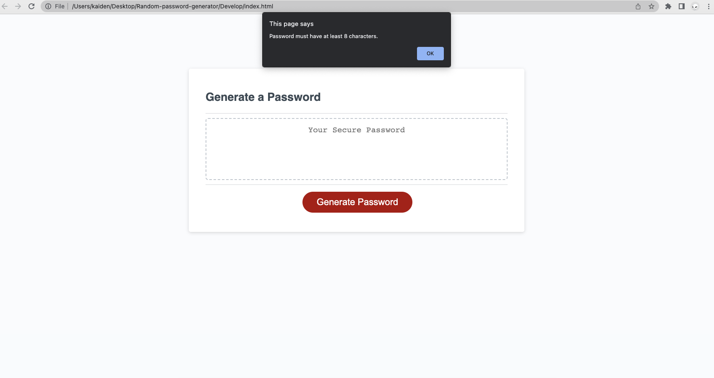
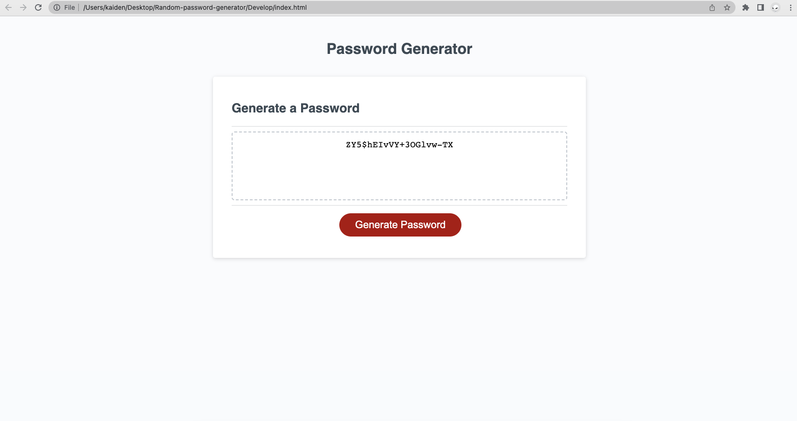
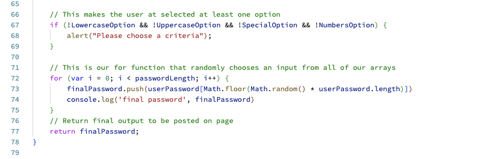

# Random Password Generator

## Description 

This project was designed to help people create strong passwords using a random system. To do this, I included all upper and lower case letters, along with numbers and special characters.

The user first has the option to choose the overall length of characters that makes up their random password. Then the user will be prompted to choose to include the other character options. Finally the application will randomly generate a string of characters based on the user's preferred inputs.

I learned to combine inputs of different variables and produce a random output based on the inputs. I will be able to build on these skills and help people secure their private information.

Here is the Link to my deployed application
https://kaidenparcher.github.io/Random-password-generator/

## Table of Contents (Optional)

* [Installation](#installation)
* [Usage](#usage)
* [License](#license)

## Installation

The only install that you will need if a basic web browser.

## Usage 

This Application is used by first clicking then red button labeled "Generate Password" 

The user then will be prompted to choose the overall length of characters that makes up their random password. Input must remain within 8-128 characters. If not, an alert will pop up like this:

Then there will be a series of pop up confirms to determine what other character sets the user would like to use. If none of the character options are chose, there will be an alert that looks like this

Here is an example of what a final password would look like if the user chose 20 characters and opted-in to all of the characters

Here is a snippet of code that I wrote for this project. This top half of this code is the alert that requires the user to choose at least one of the character sets.

Secondly is the function to randomly choose the output based on the overall password length.

## License

For this project I used the MIT Licence

---
